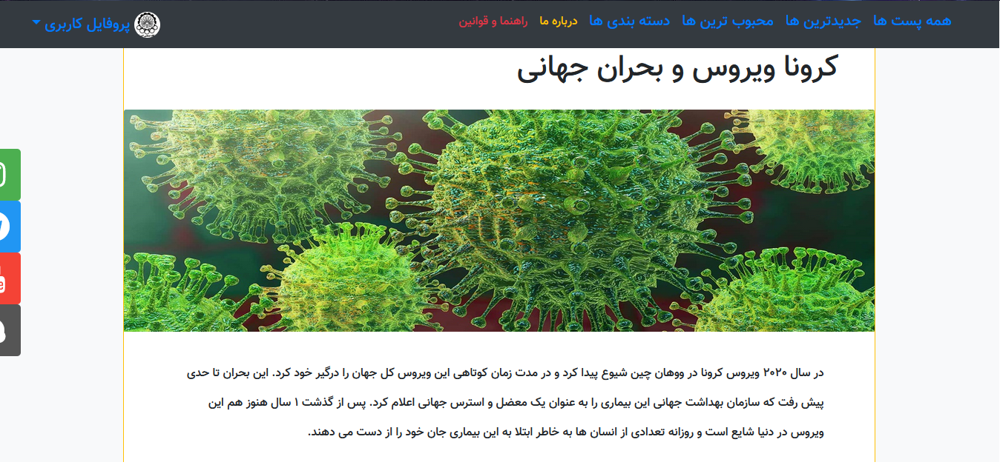

# Blog :: Django Project
  
 
## Table of contents
* [General info](#general-info)
* [Technologies](#technologies)
* [Setup](#setup)

## General info

This project is 3rd project in MaktabSharif Bootcamp that Python [+django framework], HTML, CSS, JS [+Bootstrap framework] used.
This project is a Blog that on users can write post and like or dislike posts and write comment for each post.

There are two type of users in this site:
* _Anonymous users_
* _Authenticated users_

Authenticated users in this site are divided into 4 groups with special permissions. this groups are:

* __Simple group__: Permissions for this group >>> can view posts, comments, like, dislike and star posts.[default authenticated users]
* __Writer group__: In addition to the previous group permissions, this group is allowed to write posts in site categories and add tags.
* __Editor group__: In addition to the previous group permissions, this group can edit, verify and activate posts and comments. 
* __Manager group__: this group of users have all permissions.[similar to superuser]


Some examples of photos from the blog site are displayed below:


 
   

## Technologies
Project is created with:
* Python: 3.8
* Django: 3.1.4
* HTML
* CSS
* JavaScript
* Bootstrap


For more information go to requirements.txt file in repository.

	
## Setup
To run this project, install all requirements:
```
pip install requirements.txt
```
After install all packages you can run server and visit the site and signup!

Go to maktablog directory and in terminal:

```
...\maktablog> python manage.py runserver
```


##### Good Luck! :v::sunglasses:


